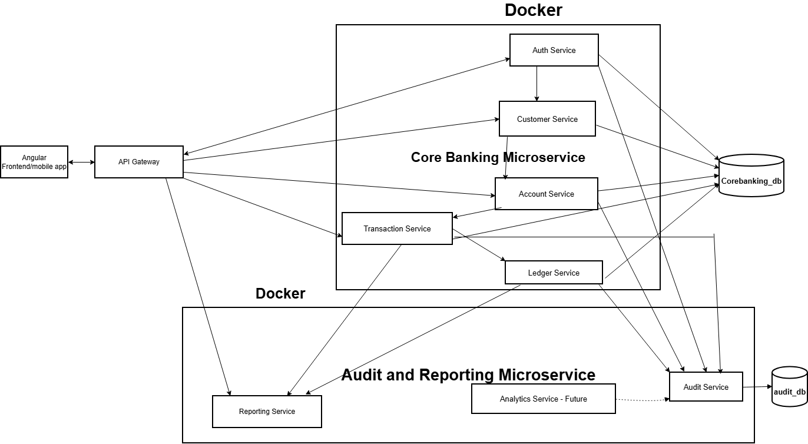

# **MIFOS Core Banking System**

## **Description**
Micro Finance Open Source(MIFOS) is an open-source core banking system 
used by microfinance institutions, digital banks, and fintechs to manage financial 
services like:Client onboarding, Savings and loan accounts, Transactions and 
repayments, General ledger accounting, Reporting and analytics. It compose of two services; the corebanking
 and the audit-service(audit and reporting), that communicate through feign client

## **Components**
The application is a microservice application  that composed of two services;
* **The Core Banking Service**
* **The Audit and Reporting Service**

## **Table of Contents**
1. [System Architecture](#system-architecture--design-diagram)
2. [Features](#features)
3. [Installation](#installation)
4. [Configuration](#configuration)
5. [Usage](#usage)
6. [Contributing](#contributing)
7. [Contact Authors](#Contact-author)
8. [Acknowledgement](#Acknowledgement)

## System Architecture
The diagram below illustrates the high-level architecture of the MIFOS Core Banking System,
showing how the Core Banking Service and the Audit & Reporting Service communicate
and interact with shared infrastructure components.


## Features
This application has several key features which include:
* **Client onboarding**
* **Savings and loan accounts**
* **Transactions and repayments**
* **General ledger accounting**
* **Reporting and analytics**

## Installation
### 1. Prerequisites (Requirements)

Every user of this app should install the following:
**Java Development Kit (JDK):** Version 17 or higher is required. We recommend the [Adoptium Temurin JDK](https://adoptium.net).
*   **Apache Maven:** Used for project build automation and dependency management. You can download it from the [Maven Official Website](https://maven.apache.org).
*   **Git:** For cloning the source repository.
*   **A Database Server:** [PostgreSQL](https://www.postgresql.org) is used in this project, but any compatible relational database should work.
*   **An IDE:** An Integrated Development Environment like [IntelliJ IDEA](https://www.jetbrains.com) or [Eclipse](https://www.eclipse.org) is recommended for development.
    Use code with caution.

### 2. Getting the Code (Cloning/Downloading)

You can download or clone the source material using Git. Open your terminal or command prompt and run the following commands:

```bash
# Clone the repository from GitHub (replace the URL with your project's actual URL)
git clone https://github.com/Stephenekeh-dev/banking-platform.git
```
Then open two Intellij windows so that you can run each service 
of the application in a separate window as each service is a different 
project that exists in a single repository(MonoRepository).So, every 
configuration and command must be for each project.
```bash
# Navigate into the project directory for each project(service)
cd corebamking   # For the corebanking service
cd audit-service  # For the audit-service
```
Note that the commands above should be run 
in their respective intellij bash terminal

### 3. Step-by-Step Installation Instructions

Once you have navigated into the projects directories use **Apache Maven** to manage the project dependencies and build the application package.

```bash
# Install all required dependencies and compile the project
./mvnw clean install   #For each project
```

### 4. Running the Application

To start the application locally using Maven, open your terminal or command prompt in the project's root directory and execute the following command:

```bash
# Run the Spring Boot application directly from the command line
./mvnw spring-boot:run
```
## Configuration
Configure the database credentials unique to your database 
in the application.yml as below for each project. The first below is
for the corebanking service.

```bash
spring:
  datasource:
    url: jdbc:postgresql://localhost:5432/corebanking_db
    username: xxxxxxxx
    password: xxxxxxxxxxxxx

  jpa:
    hibernate:
      ddl-auto: update
    show-sql: true
    properties:
      hibernate:
        dialect: org.hibernate.dialect.PostgreSQLDialect

server:
  port: 8080
```
The next is for the  audit-service 
```bash
spring:
  application:
    name: audit-service
  security:
    oauth2:
      resourceserver:
        jwt:
          secret: v2DQ/qdsoALW2JjL8a86ENcoBIE1QWAm2sIn10LJa1U=

  main:
    allow-bean-definition-overriding: true

  datasource:
    url: jdbc:postgresql://127.0.0.1:5432/corebanking_db
    username: xxxxxxx
    password: xxxxxxxxx
    driver-class-name: org.postgresql.Driver

    jpa:
      hibernate:
        ddl-auto: update
      show-sql: true
      properties:
        hibernate:
          dialect: org.hibernate.dialect.PostgreSQLDialect


corebanking:
  base-url: http://localhost:8080

server:
  port: 9090
```
## Usage
### Running the Application from IDE
Open the cloned project with IntelliJ or any IDE of your choice.
You can run the main application
class directly (e.g., com.example.YourApplication.java).
Note that the application has two services(corebanking and audit-service). The 
two applications should be started. 
The **corebanking** service runs on http://localhost:8080, while the **audit-service** runs on  http://localhost:9090


### Running the Application from Command Line
You  can run the generated jar file
```bash
java -jar target/corebanking-0.0.1-SNAPSHOT.jar
java -jar target/audit-service-0.0.1-SNAPSHOT.jar


```
### Running with Docker (Optional)
If you prefer to use Docker, you can build and run the image:
first start your installed docker desktop.
```bash
docker build -t core-banking-app .
docker run -p 8080:8080 core-banking-app
docker build -t audit-service .
docker run -p 9090:9090 audit-service
```

## Contributing
Contributions are what make the open-source community such an
amazing place to learn, inspire, and create. Any contributions
you make are greatly appreciated.
1. Fork the Project
2. Create your Feature Branch (git checkout -b feature/AmazingFeature)
3. Commit your Changes (git commit -m 'Add some AmazingFeature')
4. Push to the Branch (git push origin feature/AmazingFeature)
5. Open a Pull

## Contact Author
* **Stephen Eken**  - stevenadibee@yahoo.com - https://github.com/Stephenekeh-dev
* Project Link: https://github.com/Stephenekeh-dev/banking-platform.git

## Acknowledgments
* AB Microfinance
* Mifos Initiative
* Spring Boot Documentation
* PostgreSQL Documentation


